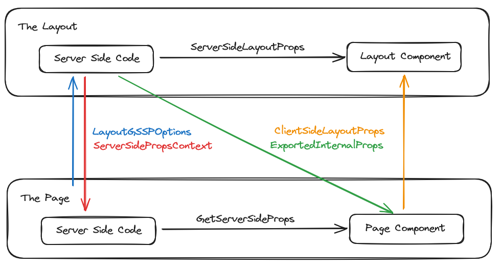

### @scinorandex/layout

Create typesafe layouts with Next.js Pages router.

--- 

### Use case

Your layout component needs data from the server (such as the currently logged in user) and you don't want to request it on the client side when the page loads. You must fetch the data with `getServerSideProps` / `getStaticProps` and pass it to the layout.

This package makes it easy to send data between the client and server, and from `getServerSideProps` / `getStaticProps` and the page function.

### Getting Started

**To get started, install the package in your Next.js Pages router project:**
```bash
yarn add @scinorandex/layout # or 'npm install @scinorandex/layout'
```

**Create a new file for your layout and import the ff:**
```ts
import { GenerateLayout, GenerateLayoutOptionsImpl } from "@scinorandex/layout";
```

**Define the types of data to be transferred between the different parts of the layout:**
```ts
// in private/common.ts
interface PrivateLayoutOpts extends GenerateLayoutOptionsImpl {
  ServerSideLayoutProps: { user: UserT };
  ClientSideLayoutProps: { title: string };
  ExportedInternalProps: { user: UserT };
  ServerSidePropsContext: { user: User; db: PrismaClient };
  LayoutGSSPOptions: { permisisonRequired: "admin" | "superadmin" };
}
```

This type acts as the contract of what your server side code should produce, and what your client side code can consume, and types all potential flows of data in the layout.

We extend `GenerateLayoutOptionsImpl` so that we don't have to specify empty types for properties we won't use. If we only want to define `ServerSideLayoutProps`, we don't need to define the rest as empty objects.

**What each property means and where it's used:**

 - `ServerSideLayoutProps` - data that the layout component needs from the server
   - The layout component shows the user's profile, so we need the user DTO from the server.
 - `ClientSideLayoutProps` - data that the layout component needs from the page component
   - The layout component needs the title of the page (passed into `next-seo`) 
 - `ExportedInternalProps` - data that the layout component passes into the page component
   - The layout component passes the user DTO it got from the server into the page componen
 - `ServerSidePropsContext` - data that's passed from the layout's gSSP function and into the page's gSSP
   - Some page's gSSP might need the user object, which the layout's gSSP already calculated. This allows the reuse objects between the layout and page gSSPs. 
 - `LayoutGSSPOptions` - Options that are passed from the page and into
   - This allows you to pass parameters into the layout's gSSP. In this case, you can set the minimum required authorization for the user to access the page. 

**Data flow visualization:**


**Implement the layout's frontend:**

```tsx
// in private/frontend.tsx
import { implementLayoutFrontend } from "@scinorandex/layout";
import { PrivateLayoutOpts } from "./common";

export const PrivateLayoutFrontend = implementLayoutFrontend<PrivateLayoutOpts>({
  // You're asked to implement this method if ExportedInternalProps has properties defined
  // This method determines the exported internal props from the layout's gSSP method
  generateExportedInternalProps(internalProps) {
    return { user: internalProps.user };
  },

  // This is the React component that wraps around your page
  // layoutProps is ClientSideLayoutProps & { children: React.ReactNode } and comes from the page
  // internalProps is ServerSideLayoutProps and comes from the layout's gSSP method
  layoutComponent({ layoutProps, internalProps }) {
    return (
      <div className={styles.root}>
        <NextSeo title={layoutProps.title} openGraph={{ title: layoutProps.title }} />

        <header className={styles.header}>
          <div className={styles.inner}>
            <h1>Gene Eric Blog</h1>
            <p>{internalProps.user.username}</p>
          </div>
        </header>

        <main className={styles.main}>{layoutProps.children}</main>
      </div>
    );
  },
});
```

**Implement the layout's backend**

Then, we can implement the server side data fetching logic of the layout. They can be defined behind `getServerSideProps` or `getStaticProps`, depending on the needs of the route, using `implementLayoutBackend` and `implementLayoutStatic` respectively.

Example using `getServerSideProps`:

```ts
// in private/backend.ts
import { implementLayoutBackend } from "@scinorandex/layout";
import { PrivateLayoutOpts } from "./common";

// We use getServerSideProps here because the layout inherently needs user-specific data, 
// which requires auth and cookies, which is only possible with the request object 
// provided by getServerSideProps
export const PrivateLayoutBackend = implementLayoutBackend<PrivateLayoutOpts>({
  // You're asked to implement getServerSideProps if ServerSideLayoutProps has properties defined
  // Here, you can fetch data for the layout, and even do middleware-like auth checking
  // ctx is the Next.js GetServerSidePropsContext object
  // options is the LayoutGSSPOptions object from the page
  async getServerSideProps(ctx, options) {
    const user = await getUser(ctx);

    // if the user isn't logged in, then redirect back to login page
    if (!user) return { redirect: { destination: "/login", permanent: false } };

    // if the user doesn't have necessary permissions, redirect to a forbidden page
    if (options.permissionsRequired === "superadmin" && user.accountType === "admin")
      return { redirect: { destination: "/forbidden", permanent: false } };

    return {
      props: {
        // This is the data sent to the layout component, and is typed as ServerSideLayoutProps
        layout: { user: Cleanse.user(user) },
        // This is the data sent to the page's getServerSideProps handelr, and is typed as ServerSidePropsContext
        locals: { user, db },
      },
    };
  },
});
```

Example using `getStaticProps`:

As said in the previous example, the Private layout inherently requires user specific data, making it unsuitable for `getStaticProps`. Let's create a public layout that uses a recent highlight of `Post`sinstead.

```tsx
// in public/common.ts
interface PublicLayoutOpts extends GenerateLayoutOptionsImpl {
  ClientSideLayoutProps: { title: string };
  ServerSideLayoutProps: { highlightedPosts: { title: string, uuid: string }[] };
}

// in public/frontend.tsx
import { implementLayoutFrontend } from "@scinorandex/layout";
import { PublicLayoutProps } from "./common";

export const PublicLayoutFrontend = implementLayoutFrontend<PublicLayoutProps>({
  layoutComponent({ layoutProps, internalProps }) {
    return (
      <div className={styles.root}>
        <NextSeo title={layoutProps.title} openGraph={{ title: layoutProps.title }} />
        
        <header>
          <h1>Today's highlighted posts</h1>
          {layoutProps.highlightedPosts.map((post) => (
            <a href={`/post/${post.uuid}`} key={post.uuid}>
              {post.title}
            </a>
          ))}
        </header>

        <main className={styles.main}>{layoutProps.children}</main>
      </div>
    );
  },
});

// in private/backend.ts
import { implementLayoutStatic } from "@scinorandex/layout";
import { PublicLayoutProps } from "./common";

export const PublicLayoutStatic = implementLayoutStatic<PublicLayoutOpts>({
  // You're asked to implement getStaticProps if ServerSideLayoutProps has proeprties defined
  // ctx is GetStaticPropsContext
  async getStaticProps(ctx) {
    const highlightedPosts = [
      { uuid: crypto.randomUUID(), title: "Post 1" },
      { uuid: crypto.randomUUID(), title: "Post 2" },
      { uuid: crypto.randomUUID(), title: "Post 3" },
    ];

    return {
      props: {
        layout: { highlightedPosts },
      },
    };
  },
});
```


**Use the layout:**

Now that the necessary functions are implemented, we can finally use it in a page.

```tsx
// Define the props that the are specific to the page
interface Props {
  post: { title: string; content: string; };
}

export default PrivateLayoutFrontend.use<Props>((props) => {
  // This is page specific frontend code.
  // Its return type is ClientSideLayoutProps & { children: React.ReactNode }
  // props is a merging of the result of *the page's* getServerSideProps and ExportedInternalProps
  // In this case, its type is { post: { title: string; content: stirng; }; user: UserT }
  return {
    title: `Editing ${props.post.title}`,
    children: (
      <div>
        <form>
          <input value={props.post.title} name="title" />
          <textarea value={props.post.content} />
          <button type="submit">Edit</button>
        </form>
      </div>
    ),
  };
});

// The first type parameter dicates the props specific to the page
// The second parameter specifies the route of the current page, used to determine params
export const getServerSideProps = PrivateLayoutBackend.use<Props, "/admin/[postUuid]">({
  layoutGsspOptions: { permissionsRequired: "admin" },
  
  // You're asked to implement this method if Props has properties defined.
  // ctx - the Next.js GetServerSidePropsContext object
  // locals - the locals object passed from the layout's getServerSideProps output
  async getServerSideProps(ctx, locals) {
    // ctx.params is typed depending on the Route type provided into .use()
    // The library extracts all route parameters from the string and maps them into
    // a typesafe object used to type ctx.params
    // `/[uuid]` map to { uuid: string }
    // `/[...rest]` and `/[[...rest]]` map to { uuid: string[] }
    
    // Exmaple: 
    // `/admin/[section]/[[...subsections]]` map to { section: string, subsections: string[] }
    
    // Note that due to how GetServerSidePropsContext is typed, ctx.params is an optional field
    // hance for the need to undefine-check. To get around this, look at the advanced section
    const uuid = ctx.params?.postUuid; // is typed as string | undefined

    if (uuid) {
      const post = locals.db.posts.findMany({ where: { uuid } });
      if (post) return { props: { post } };
    }

    return { notFound: true };
  },
});
```

---

### Advanced

This section includes things to make life easier when using pages router, including augmenting the default types to make them more useful.

**Marking `GetServerSidePropsContext["params"]` as non-optional**

This removes the optional marker from the params field of `GetServerSidePropsContext["params"]`, which is useful since the library explicitly types them based on the route string. Put this in a `global.d.ts` file at the root of your Next.js project.

```ts
import type {
  GetServerSidePropsContext as OriginalGetServerSidePropsContext,
  GetServerSidePropsResult,
  GetStaticPropsContext as OriginalGetStaticPropsContext,
} from "next/types";

declare module "next" {
  // makes Params non optional since @scinorandex/layout explicitly types them
  export type GetServerSidePropsContext<
    Q extends ParsedUrlQuery = ParsedUrlQuery,
    D extends PreviewData = PreviewData
  > = OriginalGetServerSidePropsContext<Q, D> & { params: Q; };
  
  export type GetStaticPropsContext<
    Params extends ParsedUrlQuery = ParsedUrlQuery,
    Preview extends PreviewData = PreviewData
  > = OriginalGetStaticPropsContext<Params, Preview> & {
    params: Params;
  };


  export type GetServerSideProps<
    P extends { [key: string]: any } = { [key: string]: any },
    Q extends ParsedUrlQuery = ParsedUrlQuery,
    D extends PreviewData = PreviewData
  > = (context: GetServerSidePropsContext<Q, D>) => Promise<GetServerSidePropsResult<P>>;
}

export {};
```